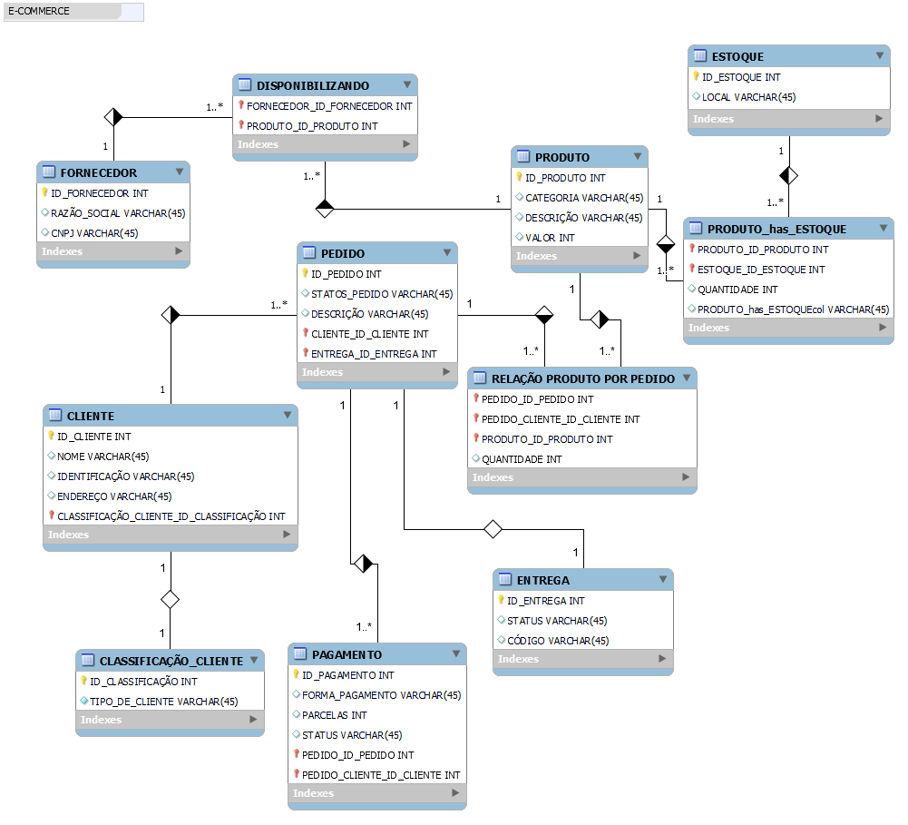

# Modelo de Relacionamento de E-Commerce 

<h1 align="left">Olá , Este é meu projeto de relacionamento com SQL</h1>

Para esse projeto foi utilizado a seguinte stack:  
&nbsp;
&nbsp;

 

O projeto foi hospedados usando: 
&nbsp;
&nbsp;
 

**Projeto de Relacionamento SQL**

**Visão Geral:**
O projeto de modelagem e relacionamento das tabelas foi concluído com êxito, estabelecendo uma estrutura robusta para o banco de dados. Entidades e atributos foram identificados e relacionamentos
foram cuidadosamente estabelecidos utilizando chaves primárias e estrangeiras.

 

**SQL:**

Uma das características mais poderosas do SQL é sua capacidade de lidar com relacionamentos entre tabelas. Nos bancos de dados relacionais, os dados são organizados em tabelas, e muitas vezes essas tabelas têm relações entre si.
Essas relações são estabelecidas por meio de chaves estrangeiras, que são colunas em uma tabela que fazem referência à chave primária de outra tabela.

Com os relacionamentos estabelecidos, podemos realizar consultas complexas que envolvem dados de várias tabelas. Por exemplo, podemos recuperar todos os pedidos feitos por um determinado cliente,
combinando dados das tabelas `Clientes` e `Pedidos`.

 

 

 
SITE: https://shields.io/badges/static-badge
